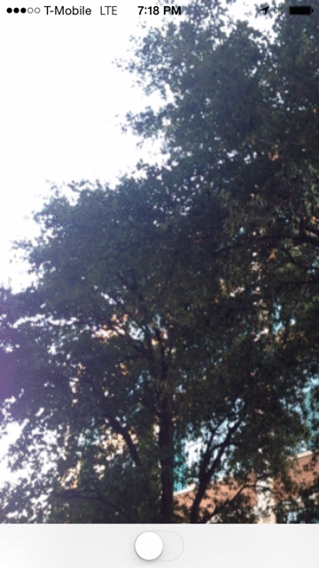
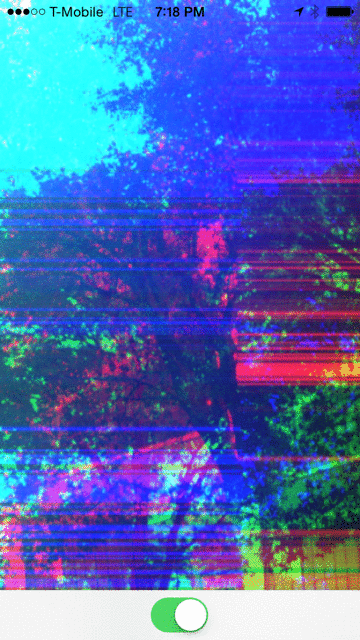

🚨🚨🚨
Notice: This repository stopped working properly after changes were made early on to the Swift language. After efforts on my part to repair the breakages, I have decided to use Metal instead for my purposes. You can [see example code here](https://github.com/bradley/iOSSwiftMetalCamera).
🚨🚨🚨

#iOSSwiftOpenGLCamera

 

This app is a basic example showing how to use Swift to setup an AVCaptureSession session to access the device's camera, pass video frames to an OpenGL view, and dynamically apply GLSL Shaders to it.
